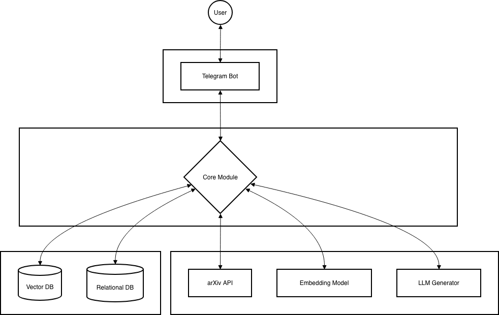

# Design-Doc: Telegram RAG-bot для анализа научных статей arXiv

## 1. Контекст проекта

### 1.1 Бизнес-задача
*   **Описание проблемы:** Чтение и анализ научных статей на arXiv занимает у исследователей, студентов и инженеров много времени. Часто необходимо быстро понять суть статьи (суммаризация) или найти ответ на конкретный вопрос (какой датасет использовался, какая архитектура модели), не читая весь текст. 
*   **Почему наше решение имеет смысл:** Интеграция в Telegram делает инструмент максимально доступным. Применение RAG (Retrieval-Augmented Generation) минимизирует галлюцинации LLM, заставляя модель опираться строго на текст статьи.
*   **Критерии успеха:**
    *   Сгенерированные ответы соответствуют содержанию статьи.
    *   Адекватное среднее время готовности статьи к вопросам.
    *   Позитивный фидбэк от пользователей.

### 1.2 Целевая аудитория и пользователи
*   **Аудитория:** Data Scientists, ML-инженеры, исследователи, студенты технических университетов.
*   **Сценарии:** Текстовый чат в Telegram. Пользователь отправляет ID статьи на arXiv в чат. В ходе диалога предусмотрена возможность саммаризовать статью с помощью команды `/summarize` или задать вопросы по статье в свободной форме.
*   **Нагрузка:** Одновременных сессий ~10 с возможностью масштабирования в случае приобретения дополнительных вычислительных мощностей. Пики ожидаются в вечернее время по UTC+3:00, а также в период сессий в университетах.
### 1.3 Ограничения и допущения
*   **Ограничения:** Бот не ищет информацию в интернете (строгий RAG по статье). Качественная обработка статьи ожидается в среднем при длине статье не более 10-15 страниц
*   **Допущения:** Пользователь отправляет валидный ID статьи и задаёт вопросы релевантные содержанию статьи.

---

## 2. Архитектура решения

### 2.1 Общая схема

1. Telegram Bot API предоставляет интерфейс взаимодействия пользователя с сервисом: принимает ID статьи с arXiv, даёт возможность саммаризовать статью, задавать по ней вопросы, завершать диалог по статье, возвращаться к предыдущим диалогам, произошедшим в течение последних 24-часов.
2. Сore Module - оркестратор системы. Управляет пайплайном загрузки статей, процессом векторизации и извлечения из векторной БД, сохраняет и извлекает диалоги из реляционной БД, направляет данные модели-генератору и возвращает ответ пользователю через Telegram Bot API
3. Vector DB - хранит векторные представления чанков статьи. Локальный хостинг. Обращение происходит, когда пользователь начинает новый диалог, и при отправке запроса пользователем
4. Relational DB - хранит диалоги пользователей. Локальный хостинг. Обращение происходит при получениии запроса от пользователя и после генерации ответа на запрос, а также при удалении диалогов через 24 часа после их создания
5. arXiv API - стороннее API. Обращаемся туда для загрузки статьи
6. Embedding model - локальная эмбеддинговая модель, обращаемся к ней для генерации векторных представлений чанков статьи при инициализации диалога, а также для поиска релевантных запросу пользователя чанков
7. LLM Generator - LLM, к которой происходит обращение по стороннему API для генерации ответов на запросы пользователя

### 2.2 Хранилище знаний / документооборот
*   **Источники знаний:** Загружаемые пользователями файлы статей
*   **Предобработка** Извлечение текстового слоя из файла пользователя
*   **Индексация:** Текст бьется на чанки. Векторизация и сохранение в Vector DB. Каждому чанку присваивается `session_id`, `user_id`
*   **Обновление данных:** Индекс статичен в рамках сессии. При удалении сессии векторы с соответствующим `session_id` удаляются из базы.

### 2.3 Интеграции и интерфейсы
*   **Внешние API:**
    *   Telegram Bot API
    *   arXiv API
    *   OpenRouter — доступ к моделям для генерации ответов на запросы пользователя.
*   **UI/UX:** Стандартный интерфейс Telegram-чата, доступны inline-кнопки "Начать сессию", "Суммаризировать", "Завершить сессию", "Вернуться к сессии", кнопки оценки сессии при её завершении
*   **Мониторинг:** Логирование фидбека пользователей при завершении сессии, сохранение сессий с негативным фидбеком

### 2.4 Инфраструктура и развертывание
*   **Архитектурный стек:** Docker, Docker Compose, Python, Qdrant, PostgreSQL
*   **Требования:** VRAM > 6GB. RAM > 16GB

---

## 3. Данные и качество знаний

### 3.1 Сбор и предобработка данных
*   **Источники документов:** Файлы arXiv статей в формате pdf
*   **Предобработка:** Извлечение текстового слоя из pdf-документа
*   **Метаданные** идентификаторы сессии и пользователя, время начала сессии

### 3.2 Векторизация и индексирование
*   **Модель embedding:** Локальная Qwen3-Embedding-0.6B-Q4_K_M-GGUF
*   **Параметры индекса:** Метрика — Cosine Similarity
*   **Cтратегия обновления:** данные в векторной БД в рамках сессии статичны, данные сессии удаляются спустя 24 часа после инициализации

### 3.3 Метрики качества знаний
*   **Hit Rate:** Как часто релевантный кусок текста из статьи попадает в топ извлеченных чанков
*   **Faithfulness:** Метрика (через LLM-as-a-judge), показывающая, что ответ сгенерирован на основе предоставленной статьи

---

## 4. Модель и генерация

### 4.1 Выбор LLM и промптинг
*   **Модель (LLM Generator):**
    *   *Qwen3 VL 235B A22B Thinking:* - модель с большим входным контекстом 131.1K токенов, одна из лучших моделей, оптимизированная для STEM-задач, что соотносится с нуждами ЦА.
    *   *System Prompt:* "Ты научный ассистент. Отвечай на вопросы пользователя ТОЛЬКО на основе предоставленных выдержек из статьи. Если ответа нет в тексте, скажи 'В статье нет информации об этом'."
    *   *Context Format:* `[Извлечённая информация из статьи:] {text_chunks}`.

### 4.2 Контроль качества ответов
* 
    *   Промпт-инжиниринг: жесткие инструкции на избегание галлюцинаций в случае, если контекст не содержит ответа на запрос пользователя
    *   Пользовательский фидбэк (👍/👎) для каждой сессии
    *   Ручной анализ сессий с негативным фидбеком

### 4.3 Обучение/дообучение
*   Дообучение **не предусмотрено**. Архитектура полностью опирается на In-Context Learning

---

## 5. UX / пользовательский опыт

### 5.1 Сценарии взаимодействия
1.  **Приветствие:** Бот описывает возможности и просит отправить ID статьи.
2.  **Загрузка:** "ID получен. Идет обработка..." -> "Готово! Что вы хотите узнать? [Кнопки: Суммаризировать, Завершить сессию]".
3.  **Q&A:** Пользователь задает вопрос -> Бот отвечает.
4.  **Завершение сессии:** Пользователь нажимает команду завершения сессии -> сессия завершается, появляются кнопки возврата к предыдущей сессиии и начала новой сессии
5. **Возврат к завершённой сессии:** Пользователь нажимает на кнопку и получает список кнопок с id отправленных в течение последних 24 часов. После выбора статьи пользователь продолжает диалог по ней
5.  **Исключительные сценарии:** Запрос пользователя не соответствует содержанию статьи -> fallback сообщение

### 5.2 Диалоговая логика и управление контекстом
*   **Multiturn диалог:** Сессии изолированы. Контекст одной статьи не пересекается с другой.
*   **Хранение:** История общения хранится в PostgreSQL
*   **Суммаризация длинного диалога:**
    *   При добавлении нового сообщения проверяется длина истории. Если она составляет более 95% контекста LLM Generator, мы обращаемся к LLM Generator с промптом: "Сделай краткую выжимку этого диалога, сохранив ключевые факты и текущий предмет обсуждения", а затем добавляем эту выжимку во вновь проинициализированные диалог, как сообщение assistant с пометкой, что это - предыдущий диалог и нужно использовать его при ответах
*   **Стиль:** Академический, вежливый

### 5.3 Метрики UX
*   **Время до готовности к диалогу:** Целевое значение < 7 минут.
*   Логирование лайков/дизлайков для анализа неудачных ответов (с согласия пользователя).

---

## 6. Безопасность, соответствие и этика

*   **Удаление данных:** Диалоги пользователя удаляются спустя 24 часа после начала и сохранются дольше только с его согласия в случае негативного фидбека
*   **Этика:** Прозрачное информирование пользователя при начале работы с ботом, что он может ошибаться, особенно в сложной математике, и ответы требуют проверки

---

## 7. План внедрения и эксплуатации

### 7.1 Этапы проекта
*   **Фаза 1: MVP.** Поддержка описанного выше функционала бота
*   **Фаза 2: Оптимизация пайплайна.** Улучшение целевых метрик бота
*   **Фаза 3: Расширение фунционала.** Эксперименты с работой с графиками и изображениями из статьи

### 7.2 Поддержка и эксплуатация
*   **Поддержка:** прямая связь с чат-бот командой
*   **Мониторинг:** логирование фидбека пользователей и диалогов с негативным фидбеком, логирование времени подготовки к первому ответу в рамках сессии
*   **Баланс API:** Контроль расходов (Billing limits) в OpenRouter при мастабировании

---

## 8. Риски и допущения

| Риск | Вероятность | Влияние | Стратегия смягчения |
| :--- | :--- | :--- | :--- |
| **Сложноcть парсинга формул и изображений из текста PDF** | Высокая | Среднее | Генерация описаний изображений и формул из статьи через VLM |
| **Галлюцинации** | Средняя | Высокое | Использование более сильной embedding-модели и модели-генератора ответов |

---

## 9. Бюджет и ресурсы

*   **Команда:** 3 MLE
*   **Инфраструктура (OPEX):**
    *   Ноутбук с RTX 3070 для хостинга ~ 1000$.
    *   API OpenRouter: бесплатно, потокенная тарификация при масштабировании

---

## 10. Приложения
*   **Словарь терминов**:
    *   *RAG* — Retrieval-Augmented Generation.
    *   *Chunking* — разбиение длинного текста статьи на небольшие фрагменты для векторного поиска.
*   **Сcылки:**
    *   https://huggingface.co/WariHima/Qwen3-Embedding-0.6B-Q4_K_M-GGUF
    *   https://openrouter.ai/qwen/qwen3-vl-235b-a22b-thinking
*   **Чек-лист готовности к запуску MVP:**
    *   [ ] Бот принимает ID статьи из arXiv и успешно её загружает
    *   [ ] Данные векторизуются и сохраняются в БД
    *   [ ] Бот возвращает пользователю осмысленные ответы по статье
    *   [ ] Работают функции кнопок, предоставленных в UI